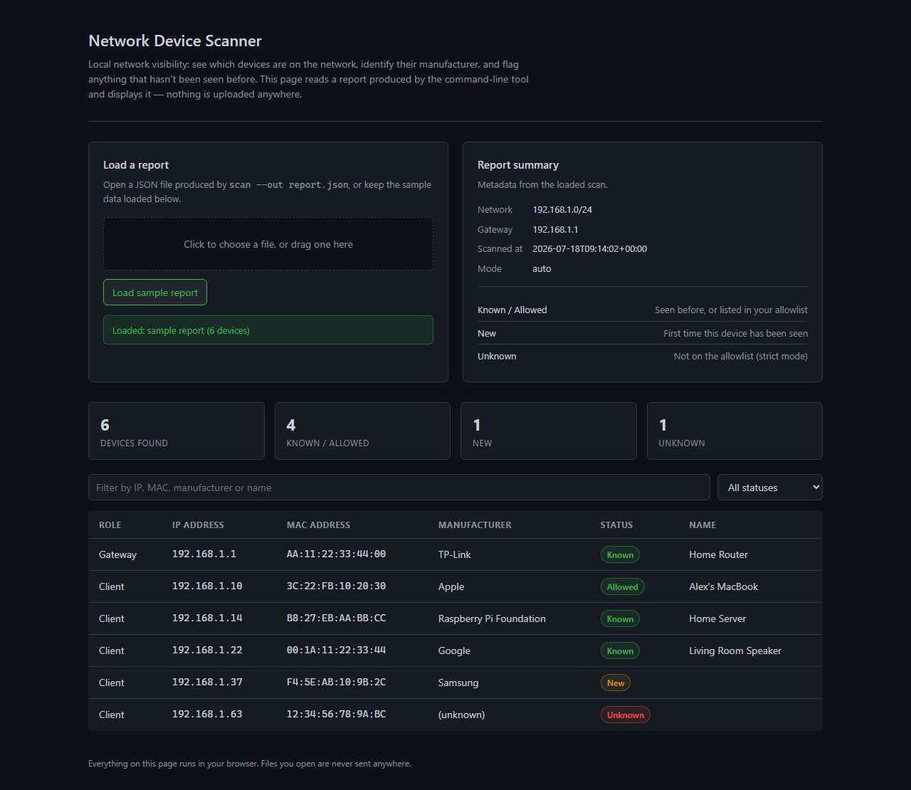
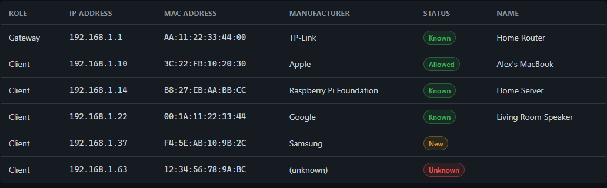

# sec-network-device-scanner

A command-line tool that scans your local network, lists every device it finds, and tells you which manufacturer likely made each one based on its MAC address. It keeps a small history of devices it has seen before, so it can flag anything new or anything you haven't explicitly allowed.

The idea is simple: most people (and most small networks) have no easy way to answer "what's actually connected to my network right now?" This tool answers that question in one command, and gives you a way to get alerted when the answer changes.

It ships with a standalone HTML report viewer as well, so scan results can be reviewed in a browser without installing anything.



---

## What it does

- Scans the local subnet and lists every device it can see, with IP and MAC address
- Looks up the manufacturer for each device from its MAC address (Apple, TP-Link, Raspberry Pi Foundation, etc.)
- Remembers devices across scans in a small local JSON database, so it knows what's new
- Flags devices that are new or not on your allowlist
- Two scanning methods: a fast ARP scan (via scapy) and a Windows-friendly fallback that doesn't need extra drivers
- A `watch` mode that rescans on an interval and stops the moment something unexpected shows up
- JSON output for scripting, logging, or feeding into other tools
- Exit codes designed for automation (see below)
- A static HTML report viewer to browse scan results visually, no server or install required

---

## The report viewer

[`ui/dashboard.html`](ui/dashboard.html) is a single, self-contained HTML file. Double-click it (or open it in any browser) and it loads with sample data already in place, so you can see what a report looks like immediately.

To view a real scan, run the tool with `--out report.json` and drop that file onto the page, or click through the file picker. Everything happens in the browser: the file is read locally and nothing is sent anywhere.



---

## How it works

1. Detects your active network interface and local subnet (e.g. `192.168.1.0/24`)
2. Scans that subnet for live hosts and resolves IP → MAC for each one
3. Looks up the MAC prefix (OUI) to identify the manufacturer
4. Compares the results against your allowlist and against devices seen in previous scans
5. Prints a table in the terminal, and optionally writes the results to a JSON file
6. Exits with a status code that reflects whether anything unexpected was found

---

## Installation

### Requirements

- Python 3.11 or newer
- Windows, macOS or Linux. The fast ARP scan needs [Npcap](https://npcap.com/) on Windows (or libpcap on Linux/macOS); without it, Windows falls back to a built-in ARP probe automatically.

### Setup

```bash
git clone https://github.com/<your-username>/sec-network-device-scanner.git
cd sec-network-device-scanner

python -m venv .venv
# Linux/macOS
source .venv/bin/activate
# Windows (PowerShell)
.venv\Scripts\Activate.ps1

pip install -e .
```

This installs the `sec-network-device-scanner` command, and also makes `python -m sec_network_device_scanner` work.

---

## Usage

### Basic scan

```bash
sec-network-device-scanner scan
```

### Save results to a file

```bash
sec-network-device-scanner scan --out report.json
```

Open `ui/dashboard.html` and load `report.json` to browse the results.

### Only flag devices you haven't explicitly allowed

```bash
sec-network-device-scanner scan --allow allowlist.json --strict
```

### Keep watching and stop on the first alert

```bash
sec-network-device-scanner watch --interval 60 --strict --allow allowlist.json
```

### Machine-readable output

```bash
sec-network-device-scanner scan --json
```

With `--json`, the human-readable table is sent to stderr and a single JSON object is printed to stdout, so it's safe to pipe.

### Example allowlist.json

```json
{
  "devices": [
    { "mac": "AA:BB:CC:11:22:33", "name": "My Laptop" },
    { "mac": "44:55:66:77:88:99", "name": "Router" }
  ]
}
```

---

## Output example

### Terminal

```
Found: 6 devices  |  New: 1  |  Unknown: 1

Role      IP             MAC                Manufacturer            Status      Name
Gateway   192.168.1.1    AA:11:22:33:44:00  TP-Link                 Known       Home Router
Client    192.168.1.10   3C:22:FB:10:20:30  Apple                   Allowed     Alex's MacBook
Client    192.168.1.14   B8:27:EB:AA:BB:CC  Raspberry Pi Foundation Known       Home Server
Client    192.168.1.22   00:1A:11:22:33:44  Google                  Known       Living Room Speaker
Client    192.168.1.37   F4:5E:AB:10:9B:2C  Samsung                 New
Client    192.168.1.63   12:34:56:78:9A:BC  (unknown)               Unknown
```

### JSON (`--json` or `--out`)

```json
{
  "timestamp_utc": "2026-07-18T09:14:02+00:00",
  "network": "192.168.1.0/24",
  "gateway_ip": "192.168.1.1",
  "counts": { "found": 6, "new": 1, "unknown": 1 },
  "devices": [
    { "role": "Gateway", "ip": "192.168.1.1", "mac": "AA:11:22:33:44:00", "manufacturer": "TP-Link", "status": "Known", "name": "Home Router" }
  ],
  "mode": { "strict": false, "learn": false, "no_db": false, "method": "auto", "max_workers": 100 }
}
```

### Exit codes

Meant to be used from scripts, cron jobs or CI:

| Code | Meaning                                                 |
| ---- | -------------------------------------------------------- |
| 0    | Nothing unexpected found                                 |
| 1    | A new or unknown device was found (depends on the mode)  |
| 2    | Runtime error (permissions, interface not found, etc.)   |

---

## Project structure

```
sec-network-device-scanner/
├─ src/sec_network_device_scanner/
│  ├─ __init__.py
│  ├─ __main__.py       # enables `python -m sec_network_device_scanner`
│  ├─ cli.py             # argument parsing, scan/watch commands, output formatting
│  ├─ scanner.py         # network detection and the actual ARP scanning
│  ├─ oui.py              # MAC address to manufacturer lookup
│  └─ storage.py         # the local "devices seen before" database
├─ ui/
│  └─ dashboard.html     # standalone report viewer, opens directly in a browser
├─ docs/
│  └─ screenshots/       # screenshots used in this file
├─ tests/
├─ pyproject.toml
├─ allowlist.example.json
└─ README.md
```

---

## Development

```bash
pip install -e .
pip install -r requirements-dev.txt

pytest
ruff check .
```

---

## Troubleshooting

**It scanned the wrong network.** If you have VMware, VirtualBox, Hyper-V, or a VPN client installed, your PC has extra virtual network adapters alongside your real Wi-Fi or Ethernet connection, and auto-detection can occasionally pick one of those instead. Run with `--show-nets` to see every network candidate the tool found and which one it picked:

```bash
sec-network-device-scanner scan --show-nets
```

VMware's default virtual adapters are easy to spot — they show up as `192.168.230.0/24` and `192.168.232.0/24`. Your real network is whichever one matches the IP address shown next to your Wi-Fi or Ethernet adapter in `ipconfig` (Windows) or `ifconfig`/`ip addr` (macOS/Linux). Once you know it, force it directly:

```bash
sec-network-device-scanner scan --cidr 192.168.1.0/24
```

**It only finds one device (the gateway).** This usually isn't a bug — it means the network has *client isolation* (also called AP isolation) turned on, which stops connected devices from seeing each other and is common on office, guest, and public Wi-Fi. Your own home router almost always has this off by default, so you should see your other devices there. If you're on your home network and still only get the gateway, try running the terminal as Administrator, or make sure [Npcap](https://npcap.com/) is installed so the tool can use the faster scapy-based scan instead of the fallback.

**Scapy prints a traceback about an interface not found.** That's scapy failing to find a real capture device (usually because Npcap isn't installed) and the tool automatically falling back to the Windows ARP method — the scary-looking traceback is informational, not fatal, and the scan still completes.

---

## Security notes and limitations

This tool is meant for networks you own or have permission to scan. It only does device discovery at the network layer (ARP) — it does not port-scan devices or attempt to identify services running on them.

A few things worth knowing:

- Results depend on what your machine can actually see on the network. VLANs, client isolation and firewall rules can all hide devices from the scan.
- Manufacturer detection is based on the MAC's OUI prefix, which is best-effort. Some manufacturers aren't in the database, and many modern devices (phones especially) randomize their MAC address, which shows up as "Local / randomized MAC" instead of a real vendor.
- Devices can be missed if they're asleep, on a different subnet, or hidden behind NAT.

---

## License

MIT — see [LICENSE](LICENSE).
